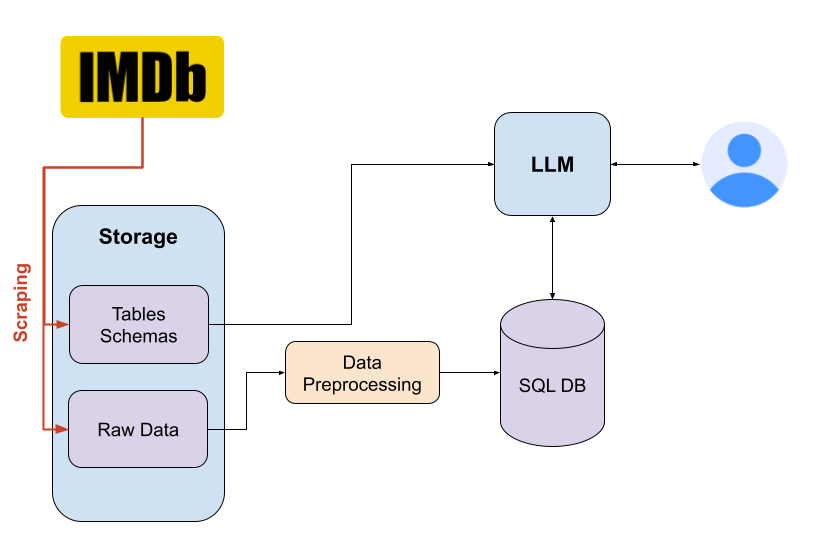

# Discussion

## Architecture

_Scraping is not included in this repository_

## Project Overview
This bot is based on SQLite and OpenAI Chat GPT. The idea was to use GPT's 
function calling to query the tables using SQL. Providing the LLM with the
tables schema and descriptions (as provided on the IMDB website), are sufficient 
for it to construct the right SQL queries. 

The idea was to allow GPT to communicate with the data using common and popular 
syntaxes and formats, which is why SQL and Markdown were selected. GPT queries the
data using SQL, and gets the result as a Markdown table. This should ensure the
LLM will be able to handle the data-querying easily.

I've decided to use OpenAI GPT for two reasons:
1. Minimal effort to get it up and running
1. Unlike many other models, it was trained to support external functions, making sure
this goes smooth as possible

Also, I've chosen GPT-4 over GPT-3.5 as its logic-handling is far superior, and it 
handles these type of questions much better.

I've decided to use SQLite to mimic an external SQL server. While slow (especially when JOINs are involved), it requires minimal installation, easy to use, and is well known - so GPT will be familiar with its SQL syntax.

## Data Preprocessing
Luckily, barely any data preprocessing was required. All I had to do was replace the
`\N` with Python `None`, and handle rows which weren't tab-separated well due to bad
formatting of the TSV files.

## Things to consider
While selecting GPT and SQLite made getting this up and running super fast, this won't
hold when trying to scale this bot usage. 

* OpenAI can temporarily stop accepting requests if the rate becomes high. Also, latency of calling the OpenAI API needs to be taken into account. Therefore, a private LLM might suit better - either a cloud-hosted one such as LLaMA, 
or other options such as Mistral-7B. The downside here is that most models do not support external function calling out-of-the-box, and adjustments would be needed.

* SQLite is not a good option when scaling an app. We can consider MySQL for medium scale, as it is still easy to maintain and deploy, and much faster and resilient.
In cae this goes to much higher scales, other DBs should be considered, such Google 
Spanner or BigQuery, for example.

* As there are only very few tables to query, it is possible to provide the bot with the entire schemas as part of the prompt. When the number of data sources scales, this might not be possible.
In these cases, an extra step of locating the correct data sources should be made. This can be done perhaps using RAG or maybe another searching mechanism. 

While the IMDB data scraping is not included, it should also be considered. As the data is updated on a daily basis,
I would use an Airflow DAG to do the following:
1. Download fresh data
2. Unzip
3. Preprocess and update SQL DB
